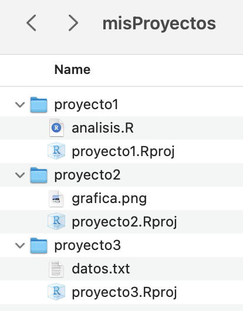

```{r xaringanExtra-clipboard, echo=FALSE}
xaringanExtra::use_clipboard()
```

class: middle, center

## Este material posee una licencia tipo Creative Commons Attribution-ShareAlike 4.0 International License. 
## Para conocer más sobre esta licencia, visite http://creativecommons.org/licenses/by-sa/4.0/

---
class: middle, center

## Material disponible en: 
### https://github.com/RLadiesCuerna/meetup_julio_2023

## Basado en el RStudioConf2020 workshop <br> What They Forgot, disponible en: 
### https://rstd.io/wtf-2020-rsc

---
# ¿Qué es un proyecto de RStudio?

- Es un archivo especial de R, compatible con RStudio, que al ejecutarlo hará 3 cosas:

  - Abrirá una nueva sesión de RStudio.
  
  - Establecerá la ubicación del proyecto como tu directorio de trabajo.
  
  - Establecerá la ubicación del proyecto como la raíz de los archivos.

---
# ¿Cómo generamos un proyecto de RStudio?

## Opción 1:

- Creando un proyecto en un directorio nuevo:

  - En las opciones de RStudio Ve a File > New project > New Directory > New Project.
  - Asigna un nombre a tu proyecto, sin espacios y sin caracteres especiales.
  - Selecciona la ubicación donde crearás el nuevo directorio.
  - Selecciona la opción Open in New Session.
  - Oprime Create Project.

---
# ¡Es tu turno! 

- Genera un proyecto de RStudio llamado ‘proyecto1’ en un directorio nuevo en tus Documentos (~/Documentos).

---
## Opción 2:

- Creando un proyecto en un directorio existente:
  
  - Crea un directorio en alguna ubicación conocida de tu computadora.
  - Asigna un nombre a tu directorio, sin espacios y sin caracteres especiales (Este será el nombre de tu proyecto).
  - En las opciones de RStudio ve a File > New project > Existing Directory.
  - Selecciona la ubicación donde previamente creaste el directorio.
  - Selecciona la opción Open in New Session.
  - Oprime Create Project.

---
# ¡Es tu turno! 

- Genera una carpeta o directorio llamado ‘proyecto2’ en tus Documentos (~/Documentos), después genera un proyecto de RStudio usando este folder como base.

---
# ¿Por qué usar proyectos de RStudio?

## Para tener un espacio organizado

.pull-left[
```{r,echo=FALSE, out.width='90%'}

```
]

.pull-right[
```{r,echo=FALSE,  out.width='100%'}

```
]

---
# ¿Por qué usar proyectos de RStudio?

.pull-left[<br>
## Compartamentalizas tu trabajo. 

## Puedes tener un proyecto por análisis.
]

.pull-right[
```{r,echo=FALSE,  out.width='90%'}
knitr::include_graphics("img/multiproyectos.png")
```
]
---
# ¿Por qué usar proyectos de RStudio?

## Puedes trabajar con varios proyectos a la vez.

```{r,echo=FALSE,  out.width='90%'}
knitr::include_graphics("img/multisesion.png")
```

---
# ¿Por qué usar proyectos de RStudio?

## Establece automáticamente tu directorio de trabajo.

### Sin proyecto de RStudio

```{r,eval=FALSE}
setwd("~/Documentos/proyecto")
```

---
### Con proyecto de RStudio

### Opción 1:

- Ve a File > Open Project o a  
File > Open Project in New Session.

- Selecciona ~/Documentos/proyecto.Rproj.

### Opción 2:

- Si estás en tu terminal puedes usar:  
open ~/Documentos/proyecto.Rproj

---
# ¿Por qué usar proyectos de RStudio?

## Puedes usar rutas relativas a los archivos.

### Sin proyecto de RStudio

```{r}
read.csv("~/Documents/meetup_julio_2023/mitabla.csv")
```

---
### Con proyecto de RStudio

```{r}
read.csv("mitabla.csv")
```

---
# ¿Por qué usar proyectos de RStudio?

## Facilita el compartir y reproducir tu trabajo

### Sin proyecto de RStudio

Esta ruta funcionará solamente en mi computadora.

```{r, eval=FALSE}
read.csv("~/Documents/meetup_julio_2023/mitabla.csv")
```

---
### Con proyecto de RStudio

Esta ruta funcionará en cualquier computadora que tenga el directorio completo del proyecto.

```{r, eval=FALSE}
read.csv("mitabla.csv")
```

---
# ¿Por qué usar proyectos de RStudio?

## Nos ayuda a establecer colaboraciones y trabajar con plataformas de control de versiones.

.pull-left[<br>
```{r, echo=FALSE,out.width='100%'}
knitr::include_graphics("img/GitHubLogo.png")
```
]

.pull-right[
```{r, echo=FALSE, out.width='80%'}
knitr::include_graphics("img/gitlablogo.jpg")
```
]

---
# ¡Es tu turno! 

Comprueba algunas ventajas de usar proyectos de RStudio.

- Genera un nuevo proyecto de RStudio llamado ‘proyecto3’, recuerda que existen varias formas para hacerlo.

- Cierra la sesión y vuelve a abrirla ejecutando desde la terminal open proyecto_3.Rproj o dando doble click sobre el archivo proyecto3.Rproj.

- Evalúa tu directorio de trabajo ejecutando en la consola de RStudio el comando getwd().

---

- Cierra la sesión y mueve toda la carpeta de tu proyecto a otra ubicación. Si lo creaste en Documentos mueve la carpeta al Escritorio o viceversa.

- Abre nuevamente el proyecto y verifica el directorio de trabajo, ¿Cambió el directorio de trabajo?

- Sin cerrar este proyecto, abre alguno de los proyectos que generaste previamente (por ejemplo proyecto2.Rproj), recuerda que puedes seleccionar Open Project in New session

---
# Buenas práticas para ordenar tu proyecto

.pull-left[
Genera carpetas con:

- Entradas (datos originales y datos filtrados).

- Procedimientos (Rscripts con el filtrado, manejo de datos, análisis, generación de gráficas).

- Salidas (Gráficas generadas y resultados).
]

.pull-right[
```{r, echo=FALSE, out.width='65%'}
knitr::include_graphics("img/proyecto1.png")
```
]

---
# ¡Es tu turno! 

- Descarga la carpeta 'proyecto_desordenado' desde https://github.com/RLadiesCuerna/meetup_julio_2023 y ordena los archivos en subcarpetas, considera las recomendaciones mencionadas anteriormente.

---
# Utiliza las rutas adecuadas a los archivos

Ahora que has reorganizado tu proyecto, debes usar las rutas relativas para importar y exportar tus archivos.

Por ejemplo:
```{r, eval=FALSE}
read.table("datos/mis_datos.txt", header = TRUE)
```

.pull-left[
Recuerda que la raiz de tu proyecto será el directorio principal.
]

.pull-right[
```{r,echo=FALSE,out.width='60%',fig.align='center'}
knitr::include_graphics("img/rutas.png")
```
]

---
# ¡Es tu turno! 

- Con tu proyecto ordenado, abre el archivo analisis.R y corrige las rutas a los archivos considerando los subdirectorios que creaste.

- ¡Mejora aún más tu proyecto! Secciona tu código y crea nuevos scripts con cada una de las secciones que detectes en el análisis.


---
# Compartiendo tus proyectos

Una de las ventajas de usar proyectos de RStudio es facilitar la colaboración con otras personas, así como compartir tu código de manera reproducible.

Lo más común es utilizar control de versiones, por ejemplo en GitHub o GitLab. Pero comencemos compartiendo nuestro proyecto mediante Drive. 

```{r,echo=FALSE,fig.align='right',out.width='28%'}

```

---
# ¡Es tu turno! 

Genera un proyecto en tu computadora que contenga lo siguiente:

- Un Rscript o Rmd con un pequeño análisis usando datos públicos de R, puedes palmperpinguins, gapminder, o el paquete datos.

- Genera al menos un archivo de salida, por ejemplo una gráfica, una tabla, un archivo de texto o un html relacionado con tu análisis.

- Crea los subdirectorios necesarios para ordenar tu proyecto y verifica que tu Rscript o Rmd contenga las rutas necesarias para leer o escribir estos archivos en las subcarpetas.

---

- ¡Intercambien proyectos! Carga tu proyecto completo en el Drive https://drive.google.com/drive/folders/1SaHgEESvcYDY1VUxUueyq2HA6XDuvse_?usp=share_link. 

- Pídele a tu compañera/o que lo descargue y compruebe que puede ejecutar el análisis en su computadora.

---
# ¡Algunos hacks!

.pull-left[
### RStudio recuerda los proyectos con los que has trabajado recientemente.

Ve a la esquina superior derecha y da click en la flecha junto al nombre de tu proyecto actual.

Verás todos los proyectos recientes. 
]

.pull-right[
```{r, echo=FALSE, out.width='85%'}
knitr::include_graphics("img/listprojects.png")
```
]

---
# ¡Algunos hacks!

Crea todos tus proyectos dentro de una carpeta principal y usa el buscador de archivos para acceder a ellos rápidamente.

.pull-left[
```{r, echo=FALSE, out.width='60%', fig.align='center'}

```
]

.pull-right[
```{r, echo=FALSE, out.width='100%'}
knitr::include_graphics("img/resultadomisproyectos.png")
```
]

---

.pull-left[<br><br><br><br><br><br><br>
.center[
# ¡Gracias!
]
]

.pull-right[<br><br><br><br>
```{r,echo=FALSE,out.width='100%',fig.align='center'}
knitr::include_graphics("img/gracias.png")
```

.pull-right[Ilustración de Allison Horst]
]

